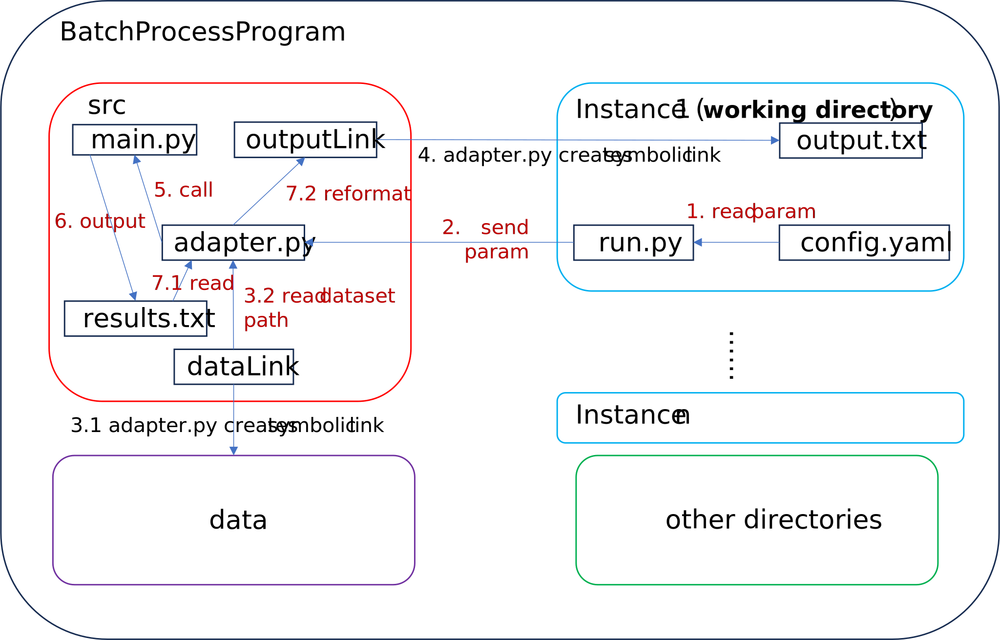

# BatchProcessProgram
A useful plugin.

## Usage Step
1. Change to the working directory "BatchProcessProgram" (i.e., the current directory containing README.md). <br>
2. Install the required packages. <br>
```
pip install -r requirements.txt
```
3. Modify all the parameters in "**src/defaults.py**" and the hyperparameter in "**hyperParam.csv**". <br>
4. Rewrite the customized program "**src/adapter.py**". Recommend to use Symbolic Link to input the dataset to the program, and to output the result to the instance directory. The format could be found in Appendix.
5. Create the instances. <br>
```
python instanceGenerator.py
```
6. Create the scripts and run the program. <br>
```
python scriptGenerator.py
./script.sh
```
7. Aggregate the output results. All the results corresponding to the hyperparameter in "**hyperParam.csv**" will be output to the file "**result.csv**". <br>
```
python resultGenerator.py
```
8. (optional) Create the configuration file of plot in Directory "**plot_config**", following the style of "**plot_config/line_template.yaml**" or "**plot_config/plot_config_template.yaml**". Then, add the file name to "**plot_config/plot_files.txt**".
9. (optional) Plot all the instances in "**plot_config/plot_files.txt**", and output the .esp file to the working directory.
```
python plot.py
```

## Input/Output Files
1. Directory "**data**", which contains the datasets. <br>
2. Directory "**src**", which contains the source codes. <br>
3. Directory "**bpp_config**", which contains the configuration files. <br>
4. Input Files (Format of those files can be found in Appendix) <br>
   1. By default, we have file "**hyperParam.csv**" for the configuration of hyper-parameters. In the this file, we use "." to spilt the tree-based sturcture. <br>
   2. "**bpp_config/files_path.txt**", which stores the names of the input/output files. In gereral, there is no need to modify the content in this file. <br>
   3. "**bpp_config/annotations.txt**", which contains the output files of the algorithm, and the corresponding metrics. <br>
   4. "**src/adapter.py**", which is the executable program of the project. (It is **a customized program**. It means that every time execute a new program, you have to reprogram this code.) <br>
   5. "**src/defaults.py**", which contains **all the default parameters** of the project. <br>
   6. "**src/run.py**", which is used to send the parameters corresponding to the instance to "**src/adapter.py**". <br>
5. Output Files (Format of those files can be found in Appendix) <br>
   1. "**result.csv**", which aggregates the result from each instance, based on the contents of "**bpp_config/annotations.txt**". <br>

  
## Appendix A. Format of "hyperParam.csv"
The first line corresponds to the names of hyper-parameters. Then, each following line corresponds to a set of hyper-parameters. Please note the the parameters in this .csv file are the subset of those in "**src/defaults.py**". <br>
The format of the line is <br>
>  , <para.1> <para.2> ... <--- names of hyper-parameters <br>
> 1, <value 1.1>, <value 1.2> ... <--- the hyper-parameters for the first instance <br>
> 2, <value 2.1>, <value 2.2> ... <--- the hyper-parameters for the second instance <br>


## Appendix B. Format of Configure File "bpp_config/files_path.txt"
Each line corresponds to a path of input/output files. <br>
> 1. The path of the file for the configuration of hyper-parameters (e.g., "hyperParam.csv")
> 2. The path of the executable program of the source code (e.g., "src/run.py").
> 3. The path of the config file for each instance in yaml style (e.g., "config.yaml").
> 4. The path of the aggregated result file (e.g., "result.csv").
> 5. The path of the scrpit (e.g., script.sh)


## Appendix C. Format of Configure File "bpp_config/annotations.txt"
Each line corresponds to an output file in each instance. It means that it could be found in each instance directory. Please note that the name of file could contain \<space\>. Each element in each line is separated by \<tab\>. <br>
The format of the line is <br>
> <file 1> <metric 1.1> ... <--- The first output file and its corresponding metric <br>
> <file 2> <metric 2.1> <metric 2.2>... <--- The second output file and its corresponding metric <br>


## Appendix D. Format of "result.csv"
The first line corresponds to the names of hyper-parameters and the metrics. Then, each following line corresponds to a set of hyper-parameters and a set of results. <br>
The format of the line is <br>
>  , <para.1> <para.2> ... <metric.1> <metric.2> ... <--- names of hyper-parameters <br>
> 1, <value 1.1>, <value 1.2> ... <result 1.1> <result 1.2> ... <--- the hyper-parameters and results for the first instance <br>
> 2, <value 2.1>, <value 2.2> ... <result 2.1> <result 2.2> ... <--- the hyper-parameters and results for the second instance <br>


## Appendix E. Format of "src/run.py"
The working directory of this program is the instance directory (e.g., 1/). <br>
The format of the program is <br>
> 1. read the configuration file (i.e., config.yaml) <br>
> 2. send the parameters to "src/adapter.py" by calling it <br>


## Appendix F. Format of "src/adapter.py"
The working directory of this program is the instance directory (e.g., 1/). <br>
The format of the program is <br>
> 1. receive the configuration file (i.e., config.yaml) <br>
> 2. create a symbolic link from "src/dataLink" to "../data" <br>
> 3. create some symbolic links from "src/outputLink" to "./output_files" <br>
> 4. call the "main.py" <br>
> 5. reformat the output from "main.py" <br>
> 6. (optional) Firstly, save the current instance dir (e.g., "1/"). Secondly, change to work dir to "src/". Then execute the source code (e.g., "main.py"). Finally, return to the instance dir. In this case, the real work dir is "src". <br>

The main workflow is: <br>



